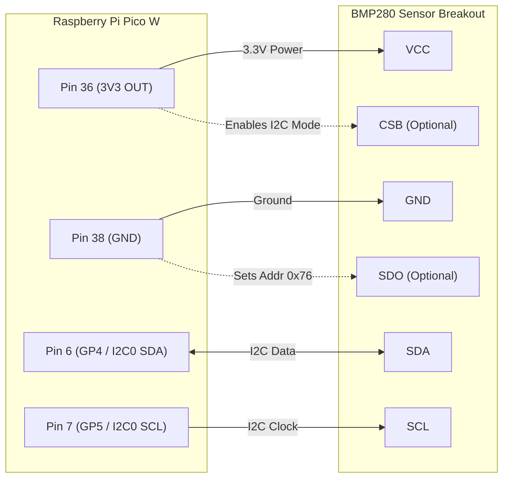

# BMP280 Sensor Wiring & Hardware Connections

This document details the wiring, pinouts, and I2C connection diagram between the **Raspberry Pi Pico W** and the **BMP280** temperature/pressure sensor module.

---

## 📌 Wiring Table

| BMP280 Sensor Pin | Pico W Physical Pin | Pico W GPIO Pin | Notes |
| :--- | :--- | :--- | :--- |
| **VCC** | Pin 36 | **3V3 (OUT)** | 3.3V Power Supply |
| **GND** | Pin 38 or Pin 8/13/18/23 | **GND** | Ground Connection |
| **SDA** | Pin 6 | **GP4** (I2C0 SDA) | I2C Serial Data |
| **SCL** | Pin 7 | **GP5** (I2C0 SCL) | I2C Serial Clock |
| **CSB** *(if present)* | - | Connect to **3V3** | Enables I2C mode (usually pulled high on module) |
| **SDO** *(if present)* | - | **GND** (0x76) / **3V3** (0x77) | Sets I2C Address (default: 0x76 when grounded) |

---

## 🔌 Connection Diagram



---

## ℹ️ I2C Address Configuration

The BMP280 sensor module uses I2C communication and defaults to one of two addresses depending on the **SDO** pin state:

- **Address `0x76` (Default on most breakouts):** SDO pin connected to **GND** or left floating with internal pulldown.
- **Address `0x77`:** SDO pin tied to **3V3**.

> **Note:** The included `main.py` script automatically scans the I2C bus and detects whether `0x76` or `0x77` is in use.

---

## ⚙️ Alternate I2C Pin Configurations

If GP4 and GP5 are already used by another device, you can use any alternative I2C hardware pin pair on the Pico W by modifying `main.py`:

```python
# Alternative: I2C0 on GP0 and GP1
i2c = I2C(0, sda=Pin(0), scl=Pin(1), freq=400000)

# Alternative: I2C1 on GP14 and GP15
i2c = I2C(1, sda=Pin(14), scl=Pin(15), freq=400000)
```

