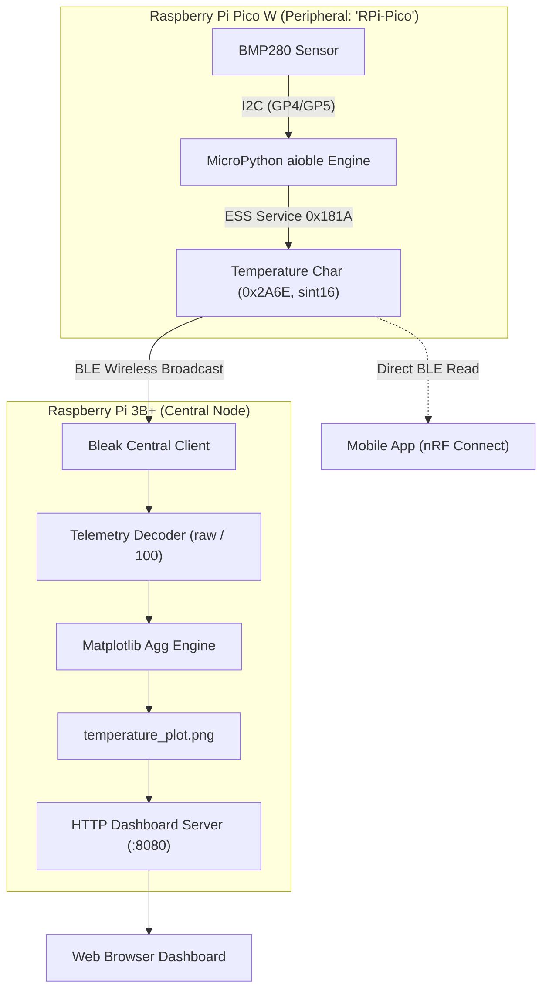
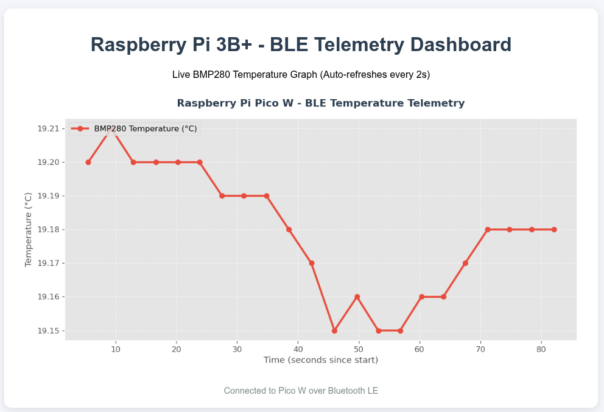
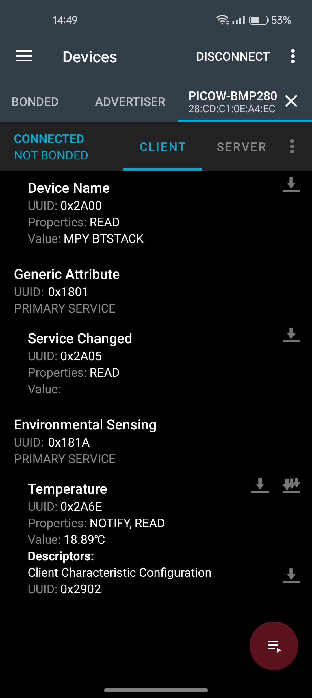

# 🌡️ End-to-End BLE Weather Telemetry System
### Raspberry Pi Pico W & Raspberry Pi 3B+ with BMP280 Sensor

An end-to-end IoT sensor system connecting a **Raspberry Pi Pico W** (BLE Peripheral) to a **Raspberry Pi 3B+** (BLE Central Client) using standard Bluetooth Low Energy (BLE) GATT protocols, MicroPython `aioble`, Python `bleak`, and real-time **Matplotlib** telemetry visualization.

---

## 🏗️ System Architecture



---

## 📂 Repository Structure

```
BLE-LAB/
├── README.md                  # Master project documentation
├── PICO/                      # Part 1: Pico W Firmware & Sensor Driver
│   ├── main.py                # Asynchronous BLE peripheral firmware (aioble)
│   ├── bmp280.py              # Bosch BMP280 I2C driver with compensation
│   ├── read_ble.py            # Local desktop test client (Bleak)
│   ├── FLASHING_GUIDE.md      # MicroPython & aioble installation manual
│   ├── WIRING.md              # I2C hardware pinout & ASCII schematic
│   └── README.md              # Subfolder guide for Pico W
├── RPI/                       # Part 2: Raspberry Pi 3B+ Central & Visualizer
│   ├── ble_telemetry_plot.py  # BLE client subscriber & Matplotlib plotter
│   ├── server.py              # Lightweight HTTP dashboard server (port 8080)
│   ├── PLAN.md                # Comprehensive Part 2 engineering plan
│   ├── README.md              # Subfolder guide for Raspberry Pi 3B+
│   └── Assignment/            # Lab assignment reference slides
└── result/                    # Live telemetry screenshots & proof of operation
    ├── plot.png               # Real-time dashboard plot screenshot
    ├── app.png                # nRF Connect mobile verification screenshot
    ├── terminal.png           # Pico W terminal output (mpremote)
    └── terminal2.png          # Raspberry Pi 3B+ telemetry & HTTP logs
```

---

## ⚡ Part 1: Pico W Sensor Node (`PICO/`)

### 1. Hardware Connections (I2C0)

| BMP280 Sensor Pin | Pico W Physical Pin | Pico W GPIO Pin | Function |
| :--- | :--- | :--- | :--- |
| **VCC** | Pin 36 | `3V3 (OUT)` | 3.3V Power |
| **GND** | Pin 38 | `GND` | Ground |
| **SDA** | Pin 6 | `GP4` (I2C0 SDA) | Serial Data |
| **SCL** | Pin 7 | `GP5` (I2C0 SCL) | Serial Clock |

> **Note:** The BMP280 breakout address is detected automatically at `0x76` or `0x77`.

### 2. Firmware Implementation (`PICO/main.py`)
- Powered by MicroPython's modern **`aioble`** and **`asyncio`** libraries.
- Advertises as **`RPi-Pico`** with Appearance `768` (Generic Thermometer).
- Concurrently executes `sensor_task()` and `peripheral_task()`.
- Standard Bluetooth SIG GATT specifications:
  - **Service:** Environmental Sensing Service (`0x181A`)
  - **Characteristic:** Temperature (`0x2A6E`)
  - **Format:** Signed 16-bit integer (`sint16`), Little-Endian, in units of $0.01\ ^\circ\text{C}$ (e.g., $18.93\ ^\circ\text{C} \rightarrow 1893$).

### 3. Upload & Run on Pico W
```bash
# 1. Install aioble package
mpremote mip install aioble

# 2. Copy driver and main firmware
mpremote cp PICO/bmp280.py PICO/main.py :

# 3. Execute
mpremote run PICO/main.py
```

---

## 🖥️ Part 2: Raspberry Pi 3B+ Central Client & Dashboard (`RPI/`)

### 1. Setup Dependencies
```bash
sudo apt-get update
sudo apt-get install -y python3-bleak python3-matplotlib python3-pip bluetooth bluez
```

### 2. Live Telemetry Collector (`RPI/ble_telemetry_plot.py`)
- Automatically discovers `RPi-Pico` via Bluetooth LE (`bleak`).
- Periodically reads the GATT Temperature characteristic every 2 seconds matching the lab design.
- Decodes the raw `sint16` bytes: $\text{Temperature} = \text{raw} / 100.0$.
- Uses Matplotlib's non-interactive `Agg` backend to generate a clean, styled telemetry plot (`temperature_plot.png`) with rolling time tracking.

### 3. Live Web Dashboard (`RPI/server.py`)
- Hosts an HTTP server on port `8080`.
- Includes JavaScript cache-busting (`?t=timestamp`) and `Cache-Control: no-store` HTTP headers to guarantee real-time updates every 2 seconds without browser caching.

### 4. Running on the Pi
```bash
# Terminal 1: Start Web Dashboard
python3 server.py

# Terminal 2: Start BLE Telemetry Collector
python3 ble_telemetry_plot.py
```
View the live dashboard in any browser at: **`http://<RPI-IP>:8080`**

---

## 📸 Verified Results & Proof of Operation

### 1. Real-Time Telemetry Dashboard
The live Matplotlib dashboard running on the Raspberry Pi 3B+ updating continuously over BLE:



### 2. Mobile BLE App Verification
Verified with **nRF Connect for Mobile** reading standard Environmental Sensing Service `0x181A` and Temperature `0x2A6E` ($18.89\ ^\circ\text{C}$):



### 3. Console & Telemetry Logs

#### Pico W MicroPython Output:
```text
============================================================
 Raspberry Pi Pico W - Async BLE BMP280 Thermometer
 Powered by aioble & asyncio
============================================================
Initializing I2C0 (SDA: GP4, SCL: GP5)...
I2C Devices found: ['0x38', '0x77']
BMP280 detected at address 0x77
Advertising BLE peripheral ('RPi-Pico')...
[BMP280 Telemetry] Temperature: 18.93 °C
[BMP280 Telemetry] Temperature: 18.95 °C
```

#### Raspberry Pi 3B+ Telemetry & Web Server Output:
```text
[Sample #24 at 89.4s] Raw: 1917 -> Temperature: 19.17 °C
[Visualization] Updated plot saved (Latest: 19.17 °C, Total samples: 24)
[Sample #25 at 93.0s] Raw: 1919 -> Temperature: 19.19 °C
[Visualization] Updated plot saved (Latest: 19.19 °C, Total samples: 25)
...
"GET /temperature_plot.png?t=1791467527261 HTTP/1.1" 200 -
```

