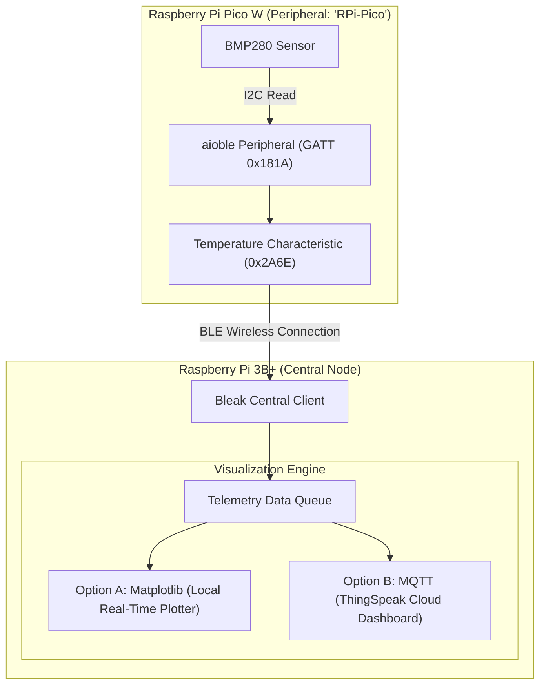

# Raspberry Pi 3B+ BLE Central & Telemetry Visualization Plan

This document outlines the architecture, step-by-step implementation plan, and execution workflow for using a **Raspberry Pi 3B+** as a BLE Central client that connects to the **Raspberry Pi Pico W**, retrieves live BMP280 temperature readings, and visualizes the telemetry data.

---

## 🎯 Architecture Overview



---

## 📋 Step 1: Raspberry Pi 3B+ Environment Setup

Run the following commands on the Raspberry Pi 3B+ to prepare Python and system dependencies (matching assignment instructions):

```bash
# 1. Update package repositories
sudo apt-get update

# 2. Install Python virtual environment & system dependencies
sudo apt-get install -y python3-venv python3-pip bluetooth bluez libbluetooth-dev

# 3. Create and activate Python virtual environment
python3 -m venv ble-env --system-site-packages
source ble-env/bin/activate

# 4. Install required Python packages
pip install bleak matplotlib paho-mqtt
```

---

## 📡 Step 2: BLE Central Client Design (`ble_client.py`)

Using the `bleak` library, the Raspberry Pi 3B+ will:
1. Scan for nearby BLE devices advertising the name **`RPi-Pico`**.
2. Connect to the Pico W's GATT server.
3. Read/Subscribe to the Temperature characteristic (`00002a6e-0000-1000-8000-00805f9b34fb`).
4. Unpack the `sint16` Little-Endian byte payload and divide by `100` to retrieve temperature in °C.
5. Push readings into an asynchronous data queue for visualization.

### Implementation Blueprint (`ble_client.py`):
```python
import asyncio
import struct
from bleak import BleakScanner, BleakClient

TEMP_UUID = "00002a6e-0000-1000-8000-00805f9b34fb"
DEVICE_NAME = "RPi-Pico"

async def run_ble_client(data_queue):
    print(f"Scanning for BLE device '{DEVICE_NAME}'...")
    device = await BleakScanner.find_device_by_name(DEVICE_NAME, timeout=10.0)

    if not device:
        print(f"Device '{DEVICE_NAME}' not found. Verify Pico W is powered on.")
        return

    print(f"Connecting to {device.name} [{device.address}]...")
    async with BleakClient(device) as client:
        print(f"Connected: {client.is_connected}")

        def notification_handler(sender, data):
            # Unpack signed 16-bit integer (hundredths of °C)
            raw_val = struct.unpack("<h", data)[0]
            temp_c = raw_val / 100.0
            print(f"[BLE Telemetry] Temperature: {temp_c:.2f} °C")
            data_queue.put_nowait(temp_c)

        # Start notification subscription
        await client.start_notify(TEMP_UUID, notification_handler)

        # Keep client connection alive
        while client.is_connected:
            await asyncio.sleep(1.0)
```

---

## 📊 Step 3: Visualization Strategies

We have two visualization approaches prepared for step 3:

### Option A: Local Matplotlib Live Plotter (Easiest - Zero Setup Required)
- **Why it's easiest:** Runs entirely locally on the Raspberry Pi 3B+ without requiring external cloud accounts or internet API keys.
- **Mechanism:** Maintains a rolling window of temperature readings (e.g. last 60 samples) and continuously updates a real-time graph or exports `temperature_plot.png`.

```python
import matplotlib.pyplot as plt

def update_plot(timestamps, temperatures):
    plt.clf()
    plt.plot(timestamps, temperatures, 'r-o', label='BMP280 Temperature (°C)')
    plt.title('Pico W BLE Sensor Telemetry')
    plt.xlabel('Sample Index')
    plt.ylabel('Temperature (°C)')
    plt.grid(True)
    plt.legend()
    plt.savefig('temperature_plot.png') # or plt.pause(0.1) for GUI
```

---

### Option B: MQTT to ThingSpeak Cloud Dashboard
- **Mechanism:** Publishes temperature data over MQTT to MathWorks ThingSpeak server (`mqtt3.thingspeak.com`).
- **Setup Requirements:**
  - ThingSpeak Channel ID & Write API Key.
  - Client ID and MQTT Credentials.
- **Publisher snippet (`paho-mqtt`):**
```python
import paho.mqtt.client as mqtt

mqtt_client = mqtt.Client(client_id=CLIENT_ID)
mqtt_client.username_pw_set(MQTT_USERNAME, MQTT_PASSWORD)
mqtt_client.connect("mqtt3.thingspeak.com", 1883, 60)

# Publish temperature to field1
payload = f"field1={temp_c}"
mqtt_client.publish(f"channels/{CHANNEL_ID}/publish", payload)
```

---

## 🚀 Execution Workflow When SSH Access Is Granted

Once SSH credentials to the Raspberry Pi 3B+ are provided:

1. **SSH Connection:** Access the RPi 3B+ shell.
2. **Environment Configuration:** Create virtual environment and install `bleak`, `matplotlib`, `paho-mqtt`.
3. **Deployment:** Copy/create the BLE subscriber & plotter scripts onto the RPi 3B+.
4. **Verification:**
   - Test BLE scanning & device discovery.
   - Run live telemetry loop and generate graph output.

